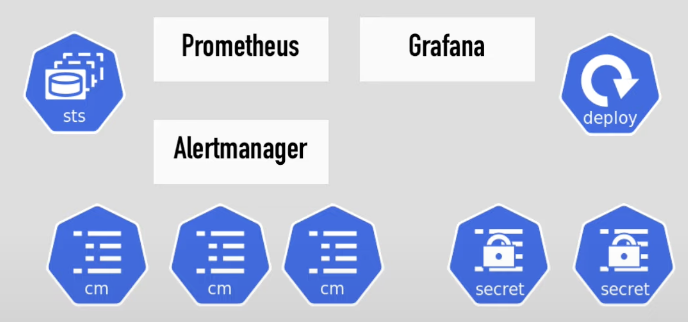
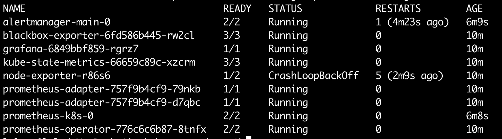
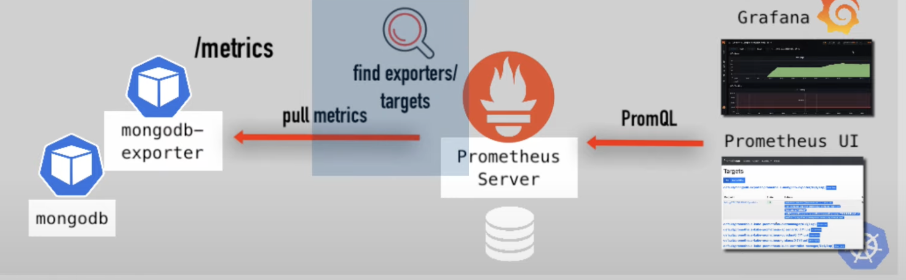
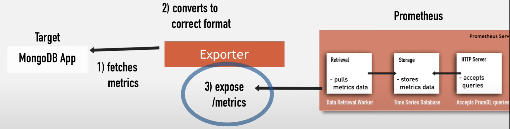
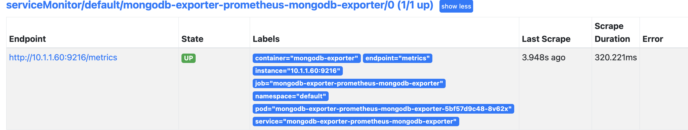

# MonitoringPlatform

软件投入生产后，对其进行监控以跟踪性能、发现基础架构和应用程序中的问题非常重要。

职责之一是：

1. 设置软件监控
2. 设置基础设施监控，例如 适用于您的 Kubernetes 集群和底层服务器
3. 可视化数据

您还应该了解系统如何收集和聚合数据，以便使用它来排除故障、获得业务洞察等。

---

#### 理论部分

> 在kubernetes集群中设置Prometheus

+ 如何工作
+ Prometheus的部分 或 组件

Prometheus核心：一个服务器来存储和处理指标数据，并且有一个告警管理器 Alertmanager，可以使用它根据 Prometheus收集和处理数据发生警报

UI可视化的Prometheus中手机和抓取的数据，有自己UI，但是还可以使用像Grafana这样的的UI镜像数据可视化，它可以从Prometheus指标构建非常强大的可视化仪表盘，

因此监控栈中有几个可以移动部件和组件


> 如何部署到 kubernetes 集群

实际上是有几种不同的方式：

1. 将所有需要的配置文件放在一起，创建这些yaml，还需要正确的顺序执行（效率非常的低，需要付出很多努力）

 

 更有效的方法是：Operator

2. prometheus operator

一般来说，将Operator视作为管理器。创建的状态集和部署，例如管理其Pod的副本重新启动当它们死掉的时候，确保它们 是可以恢复的，operator 会密切的关注并并管理有状态集部署和构成 Prometheus 技术栈的所有组件的组合 。

作为一个单元，这样就不需要 收到管理单独的部分，因此在此Operator中，将找到一个 Pormetheus Operator，并使用这些配置文件部署在集群。

最有效的第三个选项：

3. HELM Cahrt


> kube-prometheus

[github](https://github.com/prometheus-operator/kube-prometheus/tree/main) 

安装完成后会看到所有的组件，这些知识创建的部分

 

访问图形用户界面:

```
$ kubectl --namespace monitoring port-forward svc/prometheus-k8s 9090
$ kubectl --namespace monitoring port-forward svc/grafana 3000
$ kubectl --namespace monitoring port-forward svc/alertmanager-main 9093
```

默认添加的两个 Exporter

1. node：监控节点

2. kube-state-metrics：监控Kubernetes自身

   

使用prometheus 监控 mongodb 或mysql等第三方应用程序 或 kubernetes 中的如何其他服务。

 


 什么是Exporter

​		 应用程序数据或者应用程序指标与Prometheus 能够理解的指标与数据之间的转换器。

​		因此它位于应用程序和Prometheus之间，从应用程序上获取数据，将其转换为 Prometheus 能够收集导出的数据或指标，它本身将公开自身指标端口，以便 Prometheus 能够从那里抓取数据，因此它会做两件事：

1. 从应用程序收集数据并转换为`prometheus`可以理解的数据
2. 公开这些指标，使得 `prometheus` 能够抓取到它们

 


Exporter：在集群中独立于应用程序部署，这是一件好事情，当你决定监控应用程序时，不必更改部署配置文件或服务或如何不必触及应用程序的内容。

如何安装它？https://prometheus.io/docs/instrumenting/exporters/

+ 所有的可用exporter（数据库、硬件、消息系统、存储、Http等等）

```
% kubectl get pod
NAME                                  READY   STATUS    RESTARTS   AGE
mongodb-deployment-79dbdd4658-bj9q5   1/1     Running   0          13m
```

k8s中部署需要

1. exporter Pod
2. svc
3. servicemonitor

https://github.com/prometheus-community/helm-charts

找到mongodb-exporter的chart

```
helm repo add prometheus-community https://prometheus-community.github.io/helm-charts
helm show values prometheus-community/prometheus-mongodb-exporter > volume.yaml
```

需要重点关注的值，注意查看文档

```
mongodb:
  uri: "mongodb://mongodb-service:27017"

serviceMonitor:
  enabled: true
```

> 默认情况下，ServiceMonitor 处于禁用状态。`serviceMonitor.enabled`您可以通过设置为来启用 ServiceMonitor `true`

```
helm install mongodb-exporter prometheus-community/prometheus-mongodb-exporter -f mongodb-exporter-values.yaml
```

查看

```
 kubectl port-forward svc/mongodb-exporter-prometheus-mongodb-exporter 9216
```

 

好处：

1. 无需更改Prometheus的配置文件。
2. 比更改完配置文件去重新启动或重新加载应用程序方便的多。


最后需要做的事添加Grafana ui 中检查这些指标，因为这通常是我们收集这些指标的原因，以便可视化它们。

 


---


#### 进阶

[附加配置](https://github.com/prometheus-operator/prometheus-operator/blob/main/Documentation/additional-scrape-config.md)

附加配置：Additional Scrape Configuration

最后，在 CRD 中引用此附加配置`prometheus.yaml`。

+ 修改 `prometheus-prometheus.yaml`

```yaml
  additionalScrapeConfigs:
    name: additional-scrape-configs
    key: prometheus-additional.yaml
```


