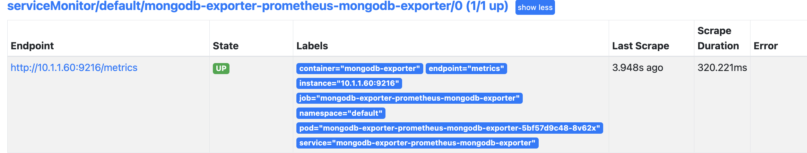

Exporter：在集群中独立于应用程序部署，这是一件好事情，当你决定监控应用程序时，不必更改部署配置文件或服务或如何不必触及应用程序的内容。

如何安装它？https://prometheus.io/docs/instrumenting/exporters/

+ 所有的可用exporter（数据库、硬件、消息系统、存储、Http等等）

```
% kubectl get pod
NAME                                  READY   STATUS    RESTARTS   AGE
mongodb-deployment-79dbdd4658-bj9q5   1/1     Running   0          13m
```

k8s中部署需要

1. exporter Pod
2. svc
3. servicemonitor

https://github.com/prometheus-community/helm-charts

找到mongodb-exporter的chart

```
helm repo add prometheus-community https://prometheus-community.github.io/helm-charts
helm show values prometheus-community/prometheus-mongodb-exporter > volume.yaml
```

需要重点关注的值，注意查看文档

```
mongodb:
  uri: "mongodb://mongodb-service:27017"

serviceMonitor:
  enabled: true
```

> 默认情况下，ServiceMonitor 处于禁用状态。`serviceMonitor.enabled`您可以通过设置为来启用 ServiceMonitor `true`

```
helm install mongodb-exporter prometheus-community/prometheus-mongodb-exporter -f mongodb-exporter-values.yaml
```

查看

```
 kubectl port-forward svc/mongodb-exporter-prometheus-mongodb-exporter 9216
```

 

好处：

1. 无需更改Prometheus的配置文件。
2. 比更改完配置文件去重新启动或重新加载应用程序方便的多。


最后需要做的事添加Grafana ui 中检查这些指标，因为这通常是我们收集这些指标的原因，以便可视化它们。

 


---

