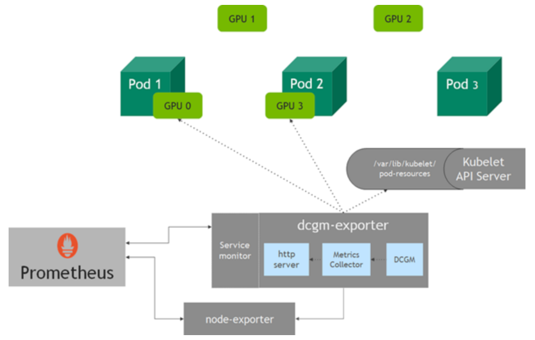
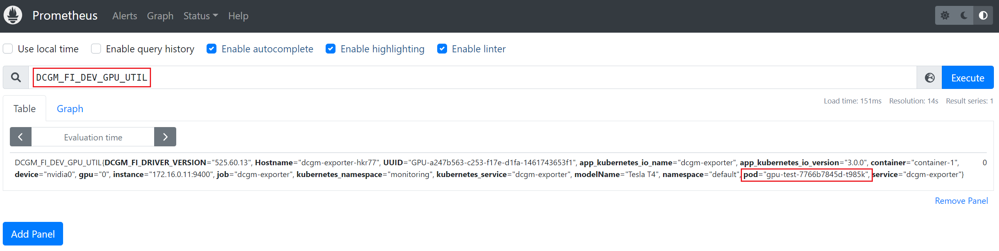

[toc]

###  dcgm-exporter

 

文档：https://github.com/NVIDIA/dcgm-exporter

+ Grafana 仪表板：https://grafana.com/grafana/dashboards/12239
+ 或者到存储库的下找到该文件`grafana/dcgm-exporter-dashboard.json`

---

##### Helm Chart 部署

> 在线方式参考文档

⚠️注意：部署前查看 values.yaml

离线部署：

```
helm install --generate-name -n monitoring .
```

调用**dcgm-exporter** API验证收集到的应用GPU信息：

> 172.16.0.11 dcgm-exporter的pod IP地址

```sh
curl 172.16.0.11:9400/metrics | grep DCGM_FI_DEV_GPU_UTIL
```

在Prometheus页面查看指标监控信息



可观察的指标

下表列出了一些可观察的 GPU 指标。更多指标的详细信息参阅[字段标识符](https://docs.nvidia.com/datacenter/dcgm/latest/dcgm-api/dcgm-api-field-ids.html#)。

| 指标名称                  | 公制类型 | 单元 | 描述         |
| ------------------------- | -------- | ---- | ------------ |
| DCGM_FI_DEV_GPU_UTIL      | 测量     | %    | GPU使用率    |
| DCGM_FI_DEV_MEM_COPY_UTIL | 测量     | %    | 内存使用情况 |
| DCGM_FI_DEV_ENC_UTIL      | 测量     | %    | 编码器使用   |
| DCGM_FI_DEV_DEC_UTIL      | 测量     | %    | 解码器使用   |

| 指标名称            | 公制类型 | 单元 | 描述                                                         |
| ------------------- | -------- | ---- | ------------------------------------------------------------ |
| DCGM_FI_DEV_FB_FREE | 测量     | MB   | 剩余帧缓冲区的数量。帧缓冲区称为 VRAM。                      |
| DCGM_FI_DEV_FB_USED | 测量     | MB   | 使用的帧缓冲区的数量。**该值与nvidia-smi**命令中的**内存使用**值相同。 |

| 指标名称                | 公制类型 | 单元 | 描述             |
| ----------------------- | -------- | ---- | ---------------- |
| DCGM_FI_DEV_GPU_TEMP    | 测量     | ℃    | 设备当前GPU温度  |
| DCGM_FI_DEV_POWER_USAGE | 测量     | 瓦   | 设备电量使用情况 |
